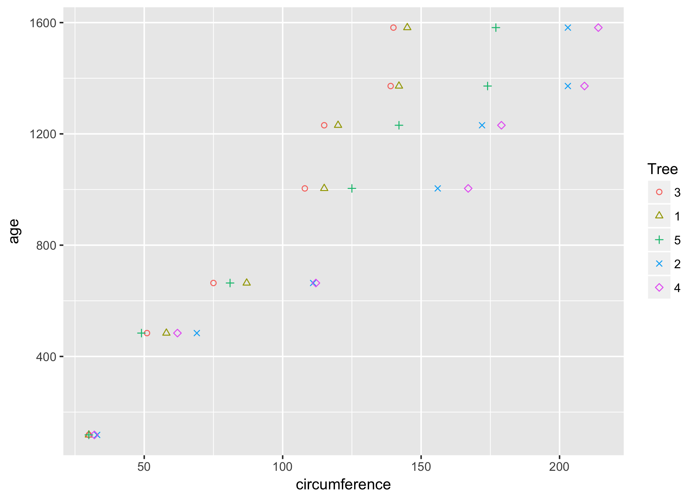
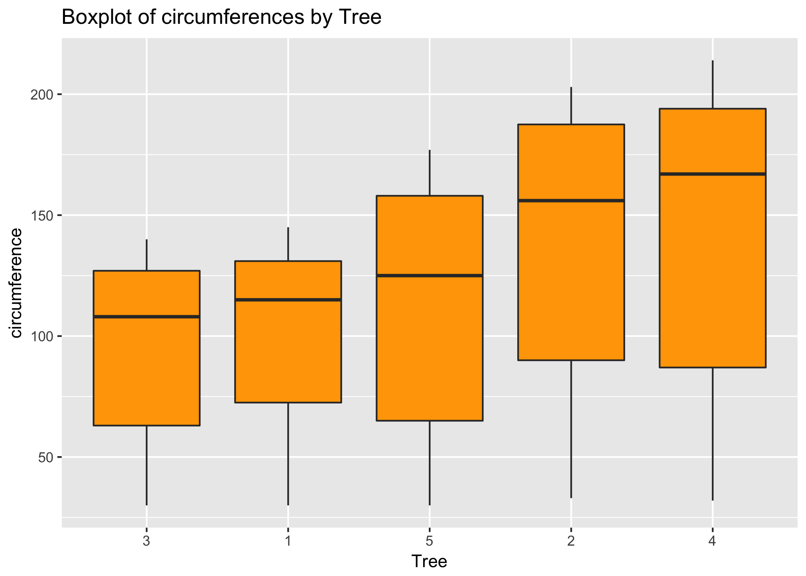
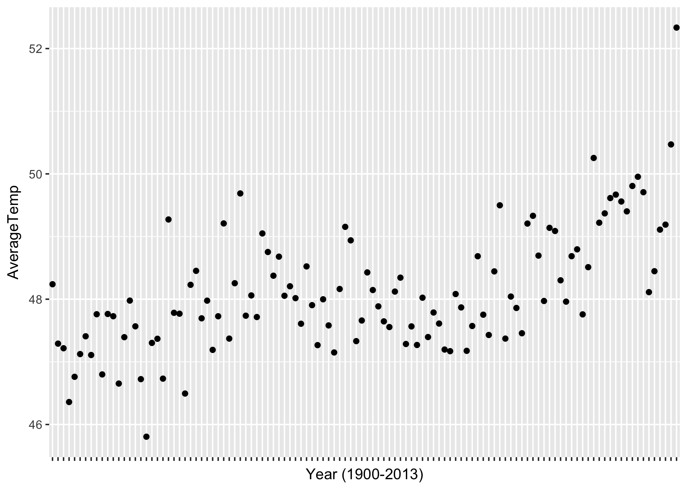
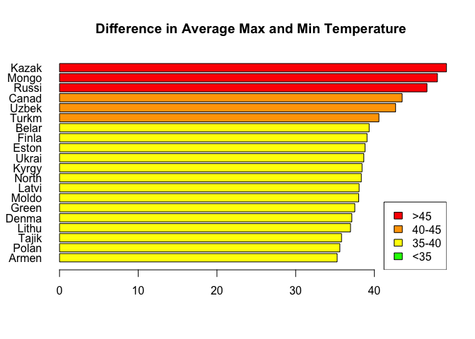
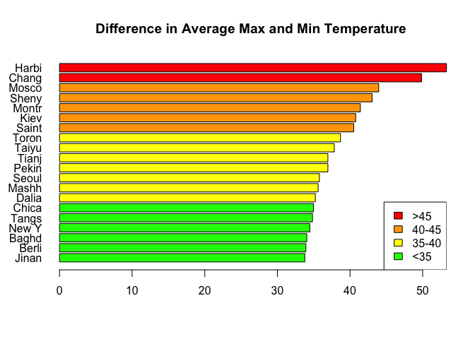

Introduction
------------

Climate change. The hot topic of the decade does not relegate its’
effects to the country with the largest carbon footprint, but rather to
the world as a whole. For a quick glance at the rising temperatures
around the globe, we investigated the difference between maximum and
minimum average monthly temperatures for different countries and cities
dating back to 1900. Below are our findings.

R Markdown
----------

The code for downloading, tyding data in a R Markdown file. The files
are included in a makefile format

    #downloading
    source("Download.R")

    #Cleaning
    source("Tyding.R")

Calculating the mean and median of the chunk circumferences for
different sizes of the trees

    #MEAN
    MeanTree<-tapply(Orange$circumference , Orange$Tree , FUN=mean,na.rm=T)
    MeanTree

    ##         3         1         5         2         4 
    ##  94.00000  99.57143 111.14286 135.28571 139.28571

    MeanTree = as.data.frame(as.table(MeanTree))

    MeanTree[1,]

    ##   Var1 Freq
    ## 1    3   94

    str(MeanTree)

    ## 'data.frame':    5 obs. of  2 variables:
    ##  $ Var1: Factor w/ 5 levels "3","1","5","2",..: 1 2 3 4 5
    ##  $ Freq: num  94 99.6 111.1 135.3 139.3

    #Changing the name of the columns
    colnames(MeanTree) <- c("Tree", "Average")
    str(MeanTree)

    ## 'data.frame':    5 obs. of  2 variables:
    ##  $ Tree   : Factor w/ 5 levels "3","1","5","2",..: 1 2 3 4 5
    ##  $ Average: num  94 99.6 111.1 135.3 139.3

    #convert Tree to numeric
    MeanTree$Tree<-as.numeric(MeanTree$Tree)

    #Sort the data
    MeanTree<-MeanTree[with(MeanTree, order(Tree)), ]
    MeanTree

    ##   Tree   Average
    ## 1    1  94.00000
    ## 2    2  99.57143
    ## 3    3 111.14286
    ## 4    4 135.28571
    ## 5    5 139.28571

    #MEDIAN

    MedianTree<-tapply(Orange$circumference , Orange$Tree , FUN=median,na.rm=T)
    MedianTree

    ##   3   1   5   2   4 
    ## 108 115 125 156 167

    MedianTree = as.data.frame(as.table(MedianTree))

    MedianTree[1,]

    ##   Var1 Freq
    ## 1    3  108

    str(MedianTree)

    ## 'data.frame':    5 obs. of  2 variables:
    ##  $ Var1: Factor w/ 5 levels "3","1","5","2",..: 1 2 3 4 5
    ##  $ Freq: num  108 115 125 156 167

    #Changing the name of the columns
    colnames(MedianTree) <- c("Tree", "Median")
    str(MedianTree)

    ## 'data.frame':    5 obs. of  2 variables:
    ##  $ Tree  : Factor w/ 5 levels "3","1","5","2",..: 1 2 3 4 5
    ##  $ Median: num  108 115 125 156 167

    #convert Tree to numeric
    MedianTree$Tree<-as.numeric(MedianTree$Tree)

    #Sort the data
    MedianTree<-MedianTree[with(MedianTree, order(Tree)), ]
    MedianTree

    ##   Tree Median
    ## 1    1    108
    ## 2    2    115
    ## 3    3    125
    ## 4    4    156
    ## 5    5    167

The average trunk circumference for each tree is:

    1   94.00000        
    2   99.57143        
    3   111.14286       
    4   135.28571       
    5   139.2857

The median trunk circumference for each tree is 1 108  
2 115  
3 125  
4 156  
5 167

Scatterplot of the TRUNK circumferences against the age of the tree.
Using different plotting symbols for different size of trees

    library(ggplot2)
    pp<-ggplot(Orange,aes(x=circumference, y=age, color=Tree, shape=Tree)) + geom_point() + scale_shape_manual(values=c(1,2,3,4,5))

    #Saving the plot in png format to be displayed in Github
    ggsave("Plot2b.png")

    ## Saving 7 x 5 in image

Displaying the trunk circumferences on a comparative boxplot against
tree.

    pppp<-ggplot(Orange, aes(x=Tree,y=circumference )) + geom_boxplot(fill="orange") +ggtitle("Boxplot of circumferences by Tree")

    #Saving the plot in png format to be displayed in Github
    ggsave("Plot2c.png")

    ## Saving 7 x 5 in image

We will analyze the temperatures for countries

    #calculate the MAXIMUM by COUNTRY
    #, Temp$City
    MaxCountry<-tapply(Temp$Monthly.AverageTemp , Temp$Country , FUN=max,na.rm=T)
    #MaxCountry[10]

    MaxCountry = as.data.frame(as.table(MaxCountry))

    #Chaging the name of the columns
    colnames(MaxCountry) <- c("Country", "MaxTemp")

    MinCountry<-tapply(Temp$Monthly.AverageTemp , Temp$Country , FUN=min,na.rm=T)

    MinCountry = as.data.frame(as.table(MinCountry))

    #Chaging the name of the columns
    colnames(MinCountry) <- c("Country", "MinAvgTemp")

    # merge two data frames by City
    Diff_CountryTemp <- merge(MinCountry,MaxCountry,by="Country")

    #calculate differences
    Diff_CountryTemp$Diff<- Diff_CountryTemp$MaxTemp - Diff_CountryTemp$MinAvgTemp

    #Sort the data
    Diff_CountryTemp<-Diff_CountryTemp[with(Diff_CountryTemp, order(-Diff)), ]

    #select the top 20
    Top20DiffCountry<-Diff_CountryTemp[1:20,]
    #Top20DiffCountry

The top 20 countries with the greatest difference monthly average
temperatures since 1900 are: 1. Kazakhstan 2. Mongolia 3. Russia 4.
Canada 5. Uzbekistan  
6. Turkmenistan 7. Belarus 8. Finland 9. Estonia 10. Ukraine  
11. Kyrgyzstan 12. North Korea 13. Latvia 14. Moldova 15. Greenland  
16. Denmark 17. Lithuania 18. Tajikistan 19. Poland 20. Armenia

    Top20DiffCountry[1:20,1]

    ##  [1] Kazakhstan   Mongolia     Russia       Canada       Uzbekistan  
    ##  [6] Turkmenistan Belarus      Finland      Estonia      Ukraine     
    ## [11] Kyrgyzstan   North Korea  Latvia       Moldova      Greenland   
    ## [16] Denmark      Lithuania    Tajikistan   Poland       Armenia     
    ## 238 Levels: Afghanistan Albania Algeria American Samoa Andorra ... Zimbabwe

    ##visualize(i)
    Top20DiffCountry2 <- Top20DiffCountry[order(Top20DiffCountry[,4], decreasing=FALSE),]
    attach(Top20DiffCountry2)
    barplot(Diff, 
            names.arg = substr(Country,0,5), 
            horiz = TRUE,
            main  = 'Difference in Average Max and Min Temperature',
            las=1,
            col=ifelse(Diff > 45, 
                       "red", 
                       ifelse(Diff > 40, 
                              "Orange", 
                              ifelse(Diff > 35,
                                     "Yellow",
                                     "Green")
                              )
                       )
            )
    legend("bottomright", legend = c(">45", "40-45","35-40","<35"), fill=c("red", "Orange", "Yellow", "Green"))

    detach(Top20DiffCountry2)

Selecting a subset of US Temperatures and we the average monthly
temperature is calculated in Fahrenheit.

    #Select US temperatures from 01/01/1900

    UStemp<-subset(Temp,Country=="United States" & DateF >="1900-01-01")
    #str(UStemp)

    #a calculate the average temperature in Fahrenheit
    UStemp$Monthly.AverageTemp.F<-UStemp$Monthly.AverageTemp*1.8 + 32

Calculating and plotting the average land temperature by year

    #adding a column with the year
    UStemp$year<-as.numeric(format(UStemp$DateF, "%Y")) 
    str(UStemp)

    ## 'data.frame':    1365 obs. of  7 variables:
    ##  $ Date                           : chr  "1/1/1900" "2/1/1900" "3/1/1900" "4/1/1900" ...
    ##  $ Monthly.AverageTemp            : num  -2.57 -2.91 2.64 8.09 14.32 ...
    ##  $ Monthly.AverageTemp.Uncertainty: num  0.443 0.533 0.358 0.263 0.239 0.379 0.478 0.353 0.359 0.431 ...
    ##  $ Country                        : chr  "United States" "United States" "United States" "United States" ...
    ##  $ DateF                          : Date, format: "1900-01-01" "1900-02-01" ...
    ##  $ Monthly.AverageTemp.F          : num  27.4 26.8 36.7 46.6 57.8 ...
    ##  $ year                           : num  1900 1900 1900 1900 1900 1900 1900 1900 1900 1900 ...

    #calculate the average by year in Fahrenheit
    UStemp2<-tapply(UStemp$Monthly.AverageTemp.F , UStemp$year, FUN=mean)
    UStemp2[1]

    ##     1900 
    ## 48.23885

    UStemp2DF = as.data.frame(as.table(UStemp2))

    UStemp2DF[1,]

    ##   Var1     Freq
    ## 1 1900 48.23885

    #Chaging the name of the columns
    colnames(UStemp2DF) <- c("Year_t", "AverageTemp")
    str(UStemp2DF)

    ## 'data.frame':    114 obs. of  2 variables:
    ##  $ Year_t     : Factor w/ 114 levels "1900","1901",..: 1 2 3 4 5 6 7 8 9 10 ...
    ##  $ AverageTemp: num  48.2 47.3 47.2 46.4 46.8 ...

    #plotting the temperatures

    z<-ggplot(UStemp2DF,aes(x=Year_t, y=AverageTemp)) + geom_point() + 
      theme(axis.text.x = element_blank()) +  labs(x="Year (1900-2013)")

    #Saving the plot in png format to be displayed in Github
    ggsave("Plot3iib.png")

    ## Saving 7 x 5 in image

Calculating the one year difference of average land temperature by year

    #shift the values of the rows down
    df <- na.omit(transform(UStemp2DF, AverageTemp_tM1 = c(NA, AverageTemp[-nrow(UStemp2DF)])))
    head(df)

    ##   Year_t AverageTemp AverageTemp_tM1
    ## 2   1901    47.29085        48.23885
    ## 3   1902    47.21720        47.29085
    ## 4   1903    46.35905        47.21720
    ## 5   1904    46.76120        46.35905
    ## 6   1905    47.12420        46.76120
    ## 7   1906    47.40815        47.12420

    #calculate the differences
    df$diffTemYears<-df$AverageTemp - df$AverageTemp_tM1 
    #str(df)
    #head(df)

    #Selecting the MAXIMUM
    maxDiffYearsT<-max(df[,4], na.rm = TRUE)
    maxDiffYearsT

    ## [1] 2.5401

    #extract the country that contains the maximum difference
    TwoYearMax<-subset(df,diffTemYears==maxDiffYearsT)
    TwoYearMax

    ##    Year_t AverageTemp AverageTemp_tM1 diffTemYears
    ## 22   1921     49.2722         46.7321       2.5401

    #The maximum difference of average land temperature by year
    TwoYearMax_Answer<-"1920-1921"

    #TwoYearMax$Answer

The years with the maximum one year difference are: 1920-1921

Now we will calculate the difference between the maximum and minimum
temperatures for each major city

    #calculate the MAXIMUM by CITY
    #, CityTemp$City
    MaxCity<-tapply(CityTemp$Monthly.AverageTemp , CityTemp$City , FUN=max,na.rm=T)
    MaxCity[10]

    ## Berlin 
    ## 23.795

    MaxCity = as.data.frame(as.table(MaxCity))

    MaxCity[1,]

    ##          Var1   Freq
    ## 1 Addis Abeba 21.223

    str(MaxCity)

    ## 'data.frame':    99 obs. of  2 variables:
    ##  $ Var1: Factor w/ 99 levels "Addis Abeba",..: 1 2 3 4 5 6 7 8 9 10 ...
    ##  $ Freq: num  21.2 35.4 32.6 28.8 26 ...

    #Chaging the name of the columns
    colnames(MaxCity) <- c("City", "MaxAvgTemp")
    str(MaxCity)

    ## 'data.frame':    99 obs. of  2 variables:
    ##  $ City      : Factor w/ 99 levels "Addis Abeba",..: 1 2 3 4 5 6 7 8 9 10 ...
    ##  $ MaxAvgTemp: num  21.2 35.4 32.6 28.8 26 ...

    MinCity<-tapply(CityTemp$Monthly.AverageTemp , CityTemp$City , FUN=min,na.rm=T)
    MinCity[10]

    ##  Berlin 
    ## -10.125

    MinCity = as.data.frame(as.table(MinCity))

    MinCity[1,]

    ##          Var1   Freq
    ## 1 Addis Abeba 14.528

    str(MinCity)

    ## 'data.frame':    99 obs. of  2 variables:
    ##  $ Var1: Factor w/ 99 levels "Addis Abeba",..: 1 2 3 4 5 6 7 8 9 10 ...
    ##  $ Freq: num  14.53 17.32 1.09 12.17 -6.2 ...

    #Chaging the name of the columns
    colnames(MinCity) <- c("City", "MinAvgTemp")
    str(MinCity)

    ## 'data.frame':    99 obs. of  2 variables:
    ##  $ City      : Factor w/ 99 levels "Addis Abeba",..: 1 2 3 4 5 6 7 8 9 10 ...
    ##  $ MinAvgTemp: num  14.53 17.32 1.09 12.17 -6.2 ...

    # merge two data frames by City
    Diff_CityTemp <- merge(MinCity,MaxCity,by="City")
    str(Diff_CityTemp)

    ## 'data.frame':    99 obs. of  3 variables:
    ##  $ City      : Factor w/ 99 levels "Addis Abeba",..: 1 2 3 4 5 6 7 8 9 10 ...
    ##  $ MinAvgTemp: num  14.53 17.32 1.09 12.17 -6.2 ...
    ##  $ MaxAvgTemp: num  21.2 35.4 32.6 28.8 26 ...

    head(Diff_CityTemp)

    ##          City MinAvgTemp MaxAvgTemp
    ## 1 Addis Abeba     14.528     21.223
    ## 2   Ahmadabad     17.320     35.419
    ## 3      Aleppo      1.086     32.629
    ## 4  Alexandria     12.171     28.806
    ## 5      Ankara     -6.195     26.044
    ## 6     Baghdad      4.236     38.283

    #calculate differences
    Diff_CityTemp$Diff<- Diff_CityTemp$MaxAvgTemp - Diff_CityTemp$MinAvgTemp
    head(Diff_CityTemp)

    ##          City MinAvgTemp MaxAvgTemp   Diff
    ## 1 Addis Abeba     14.528     21.223  6.695
    ## 2   Ahmadabad     17.320     35.419 18.099
    ## 3      Aleppo      1.086     32.629 31.543
    ## 4  Alexandria     12.171     28.806 16.635
    ## 5      Ankara     -6.195     26.044 32.239
    ## 6     Baghdad      4.236     38.283 34.047

    #Sort the data
    Diff_CityTemp<-Diff_CityTemp[with(Diff_CityTemp, order(-Diff)), ]

    #select the top 20
    Top20DiffCity<-Diff_CityTemp[1:20,]
    #Top20DiffCity

The top 20 cities with the greatest difference monthly average
temperatures since 1900 are: 1. Harbin 2. Changchun 3. Moscow 4.
Shenyang  
5. Montreal 6. Kiev 7. Saint Petersburg 8. Toronto  
9. Taiyuan 10. Peking 11. Tianjin 12. Seoul  
13. Mashhad 14. Dalian 15. Chicago 16. Tangshan  
17. New York 18. Baghdad 19. Berlin 20. Jinan

    Top20DiffCity[1:20,1]

    ##  [1] Harbin           Changchun        Moscow           Shenyang        
    ##  [5] Montreal         Kiev             Saint Petersburg Toronto         
    ##  [9] Taiyuan          Peking           Tianjin          Seoul           
    ## [13] Mashhad          Dalian           Chicago          Tangshan        
    ## [17] New York         Baghdad          Berlin           Jinan           
    ## 99 Levels: Addis Abeba Ahmadabad Aleppo Alexandria Ankara ... Xian

Plotting the top 20 countries and cities with the maximum monthly
average temperatures since 1900:

    ##Plot the top 20 Countries
    ##visualize(i)
    ##visualize(i)
    Top20DiffCountry2 <- Top20DiffCountry[order(Top20DiffCountry[,4], decreasing=FALSE),]
    attach(Top20DiffCountry2)
    barplot(Diff, 
            names.arg = substr(Country,0,5), 
            horiz = TRUE,
            main  = 'Difference in Average Max and Min Temperature',
            las=1,
            col=ifelse(Diff > 45, 
                       "red", 
                       ifelse(Diff > 40, 
                              "Orange", 
                              ifelse(Diff > 35,
                                     "Yellow",
                                     "Green")
                              )
                       )
            )
    legend("bottomright", legend = c(">45", "40-45","35-40","<35"), fill=c("red", "Orange", "Yellow", "Green"))

    detach(Top20DiffCountry2)

    ##Plot the top 20 citites
    ##visualize(i)
    Top20DiffCity2 <- Top20DiffCity[order(Top20DiffCity[,4], decreasing=FALSE),]
    attach(Top20DiffCity2)
    barplot(Diff, 
            names.arg = substr(City,0,5), 
            horiz = TRUE,
            main  = 'Difference in Average Max and Min Temperature',
            las=1,
            col=ifelse(Diff > 45, 
                       "red", 
                       ifelse(Diff > 40, 
                              "Orange", 
                              ifelse(Diff > 35,
                                     "Yellow",
                                     "Green")
                              )
                       )
            )
    legend("bottomright", legend = c(">45", "40-45","35-40","<35"), fill=c("red", "Orange", "Yellow", "Green"))

    detach(Top20DiffCity2)
